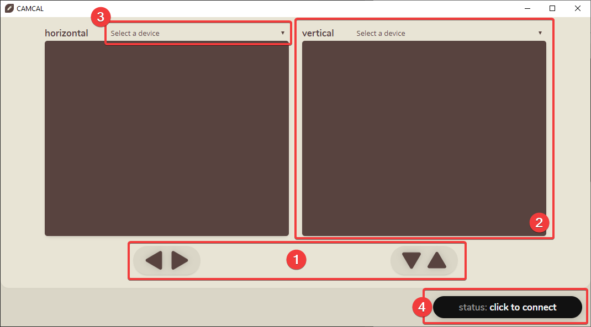
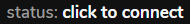
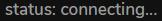
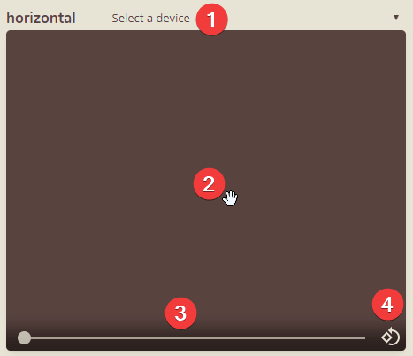
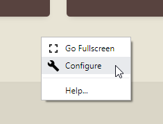
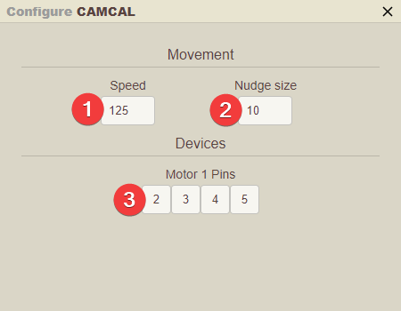
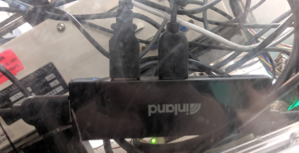

[Home](./) > [The App](#)

# The App

Welcome to CAMCAL (the CAMera CALibrator... very clever.) This site contains usage information for the software and its corresponding hardware.

## Getting Acquainted

### The Main Window



This is the main CAMCAL window. Here are the key components:

1. **[Movement controls](#controlling-movement).** When connected (see [status](#device-statuses)), use these arrow keys to nudge the platform in a given direction. Hold them down to move continuously.
1. **[The viewer](#the-viewer).** Once a camera is selected (#3), the large brown rectangle will become a live feed of the axis being controlled below it. You can pan and zoom to get the best view possible.
1. **Device selection.** A place to select what camera to use. Make sure to assign the correct camera to each axis to avoid confusion.
1. **[Device Status](#device-statuses).** Where to monitor your connection with the system.

## Installing CAMCAL

Installing CAMCAL for most users is incredibly easy. CAMCAL is only available in packaged form for windows machines, but you can easily [run it on Mac as well](#running-on-mac).

1. **Download the latest version** - It can be found at the [releases page](https://github.com/hingobway/camcal/releases/latest).
1. **Run the installer** - it may take a few seconds to appear, but _don't open it a second time._
1. That's it, except if you're on Windows 7...

### Windows 7: Board Drivers

Some Windows 7 machines experience problems finding the drivers for the Arduino. If you discover [this error](#device-or-firmware-error), here's how to fix it.

1. **[Download the drivers](https://drive.google.com/uc?export=download&id=1doBQSsSMOr0zd_82Qdcecboti1V3o3QE)**. You'll have to extract them to a folder. Make sure it's somewhere you won't accidentally delete later.
1. **Let Windows try to find drivers**. Plug in the board and wait for finding drivers to fail.
1. Go to _Devices & Printers_, right-click the "Unknown Device" and click Properties.
1. -- TODO --

### Running on Mac

Although it's not packaged for Mac, you can still run it without issue. You'll need to install [Node.js](https://nodejs.org/en/download) and [Yarn](https://yarnpkg.com/en/docs/install) first.

1. **[Download the source code](https://github.com/hingobway/camcal/releases/latest)**. Extract it to a folder.
1. **Prepare the code** - Run the following in a terminal in that folder...

   ```sh
   $ yarn && npx gulp css
   ```

Now, to run the app, just run the following in the folder (or make a shell script that runs this command):

```sh
$ yarn start
```

## Usage

### Device Statuses


This is where you can keep tabs on the status of the physical hardware. Some statuses are clickable&mdash;those ones are bold.

#### The options:

#### 

What you'll see after opening the application. Click to begin the connecting process.

#### 

While CAMCAL is attempting to find the connection.

#### 

You're connected and all buttons are now enabled (so be careful!)

#### 

Connection failed. Feel free to try unplugging the USB and plugging it back in, then click on the status to try reconnecting. Need more help? See [troubleshooting](#troubleshooting).

### Controlling Movement

See [Moving CAMCAL](using-camcal#moving-camcal).

### The Viewer



This is the viewer in CAMCAL. You'll notice there are a few tools available at the bottom&mdash;you can see them by hovering over the viewer. Here are the available features:

1. **Device Selection**.The first thing you'll need to do to use the viewer is select a camera. If you need help with that, [click here](using-camcal#choosing-camera-sources).
1. **Pan**. Drag around in the viewer to pan around the camera view.
1. **Zoom**. Drag the slider to zoom in or out.
1. **Rotate**. Useful if you'd like to use a camera upside down or attached to a wall, click this to rotate the camera in 90&deg; increments.

### Resetting the viewer

If you'd ever like to reset pan, zoom, and rotation for one of the viewers, just **double click the camera feed** to return it to its original location.

## Configuration

The app needs some configuration to run. The first time you run the application, it may ask you to configure it first. Any other time, you can reconfigure it by **right-clicking anywhere** in the app and **clicking "🛠 Configure"**.



### The options



1. **Continuous speed**. The number of steps per second that the motor turns when holding down an arrow key.
1. **Nudge size**. The number of steps to move when tapping an arrow.
1. **Motor Pins**. The Arduino pins that the motor is plugged into. If the green wires ever get unplugged, plug them into any port on that side (in order) and type in the numbers of those pins in these boxes. (Although I'd recommend you keep them as is.)

## Troubleshooting

### Camera problems

In general the cameras are very reliable, but here are a few issues that have been known to appear.

#### Camera feed is black or won't load

This is usually due to a lack of system resources. It's very simple to fix:

1. Set both camera sources to the default source ("Select a device").
1. Close and reopen CAMCAL.
1. Reselect each camera source _before you click connect_.

#### Camera doesn't appear in list of sources

If one of the cameras does not appear in the list, it usually means the computer stopped looking for USB devices.

To fix this, simply locate the black Inland USB hub (pictured), then unplug the 3 USB cables and plug them back in again.



Once that is done, restart the CAMCAL software and you should have no more issues.

### Motor connection issues

These are pretty rare to occur on the software side, so the first thing you should check is the physical connections, from the USB extension cable to the USB hub to the USB-B cable going into the controller board. For more information, see [connections](electronics#connections).

#### "Device or Firmware Error"


If you got this error, you haven't properly installed board drivers to your machine. [Instructions are here](#windows-7-board-drivers).

#### "connect timeout"

If 10 seconds elapse and CAMCAL is still unable to communicate with the controller, it will display this error. First, check to make sure the board is properly plugged in and receiving power. Then, try restarting CAMCAL, and unplugging and plugging back in the controller board.

In rare cases, you might have to restart your computer, or reset the controller. to do this, locate a small circular button next to the USB port on the black side of the controller, and press it, then restart CAMCAL.
