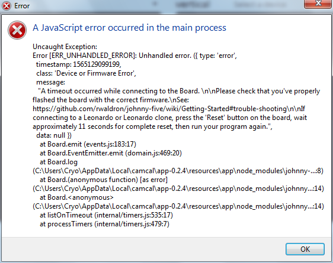

[Home](./) > [The App](#)

# The App

Welcome to CAMCAL (the CAMera CALibrator... very clever.) This site contains usage information for the software and its corresponding hardware.

## Getting Acquainted

### The Main Window

This is the main CAMCAL window. Here are the key components:

1. **[Movement controls](#controlling-movement).** When connected (see [status](#device-statuses)), use these arrow keys to nudge the platform in a given direction. Hold them down to move continuously.
1. **[The viewer](#the-viewer).** Once a camera is selected (#3), the large brown rectangle will become a live feed of the axis being controlled below it. You can pan and zoom to get the best view possible.
1. **Device selection.** A place to select what camera to use. Make sure to assign the correct camera to each axis to avoid confusion.
1. **[Device Status](#device-statuses).** Where to monitor your connection with the system.

## Installing CAMCAL

-- TODO --

### Windows 7: Board Drivers

-- TODO --

## Usage

### Device Statuses

This is where you can keep tabs on the status of the physical hardware. Some statuses are clickable&mdash;those ones are bold.

#### The options:

#### 

What you'll see after opening the application. Click to begin the connecting process.

#### 

While CAMCAL is attempting to find the connection.

#### 

You're connected and all buttons are now enabled (so be careful!)

#### 

Connection failed. Feel free to try unplugging the USB and plugging it back in, then click on the status to try reconnecting. Need more help? See [troubleshooting](#troubleshooting).

### Controlling Movement

-- TODO --

### The Viewer

-- TODO --

## Configuration

The app needs some configuration to run. The first time you run the application, it may ask you to configure it first. Any other time, you can reconfigure it by **right-clicking anywhere** in the app and **clicking "🛠 Configure"**.

-- TODO Explain config options --

## Troubleshooting

### Camera problems

In general the cameras are very reliable, but here are a few issues that have been known to appear.

#### Camera feed is black or won't load

This is usually due to a lack of system resources. It's very simple to fix:

1. Set both camera sources to the default source ("Select a device").
1. Close and reopen CAMCAL.
1. Reselect each camera source _before you click connect_.

#### Camera doesn't appear in list of sources

If one of the cameras does not appear in the list, it usually means the computer stopped looking for USB devices.

To fix this, simply locate the black USB hub (pictured), then unplug the 3 USB cables and plug them back in again.

Once that is done, restart the CAMCAL software and you should have no more issues.

### Motor connection issues

These are pretty rare to occur on the software side, so the first thing you should check is the physical connections, from the USB extension cable to the USB hub to the USB-B cable going into the controller board. For more information, see [connections](electronics#connections).

#### "Device or Firmware Error"

If you got this error, you haven't properly installed board drivers to your machine. [Instructions are here](#windows-7-board-drivers).

#### "connect timeout"

-- TODO --
