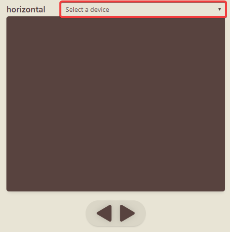
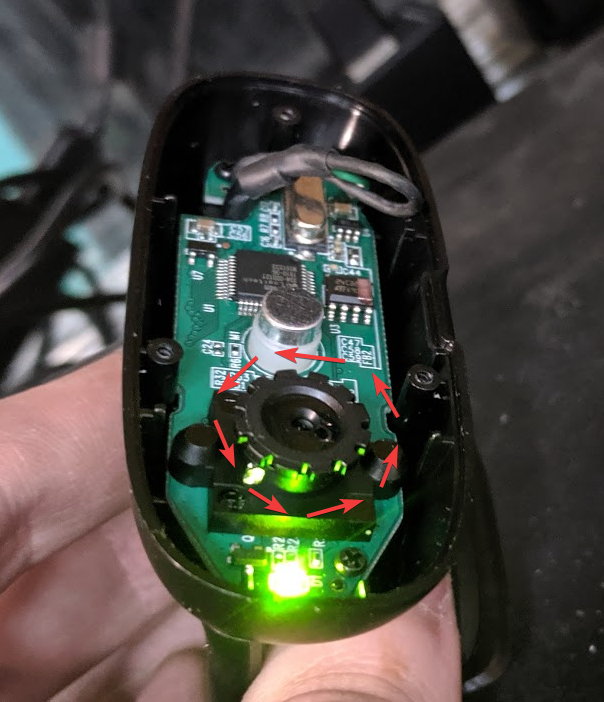

[Home](./) > [Using CAMCAL](#)

# Using CAMCAL

## Before You Start

First, make sure everything is turned on. There are two plugs used in the back of the electrospray chamber&mdash;one to power the motor and one to power the USB devices.

Also, ensure that the computer you'll be using is turned on. It could be any computer with CAMCAL installed, but the computer currently connected is the one to the right of the chamber on the ground.

## Starting CAMCAL

1. Open the CAMCAL Calibration Software. It looks like this:

   

1. Resize the window to your preference. The camera feeds will grow with a larger window size, which may improve visibility and accuracy (you'll probably have to increase both height and width to see a change.)

   If you'd like, you can also put the app in fullscreen mode by right-clicking anywhere, then clicking "Go Fullscreen".

## First Time Use

Items in this section are saved to your device, so you shouldn't have to change them after the first time, but in case you wish to again, here are the options.

### Choosing camera sources

Above each of the viewer windows, you'll notice a dropdown menu. This is where you can select the camera source for each of the viewers. This list will include all camera devices available, including any built-in webcam and the cameras plugged in inside the chamber.

The cameras you're looking for are usually labelled **USB Video Device** in the list. Although they have the same name, each device has a numerical ID before its name that helps identify whether you have different devices selected.

Once selected, a camera source should appear quickly in the brown area below it. Problems? [Read this](app#camera-problems).

### Configuring movement

In the right click menu of CAMCAL, you can find configuration options for the software. The numbers have been selected to work pretty well, but if you'd like to change speeds, this is where to go.

[Learn how here](app#configuration).

---

You'll have to do all following steps each time you use CAMCAL.

---

## Connecting to the Controller

The first thing to do once cameras are working is to connect to the hardware. To do this, simply click **click to connect** at the bottom right.

It will then try to connect to the controller. (This button also contains [device status](app#device-statuses) messages.)

Once it lets you know that it's connected, you're ready to move on.

If you fail to connect, see [this](app#motor-connection-issues).

## Camera Placement

The cameras are purposefully free-floating (not permanently attached anywhere) so you can place them where it's most convenient for you at any given time, and remove them once you're done calibrating. That said, feel free to add some sticky putty or permanently attach them somewhere if you find a spot you particularly like.

### Make use of the software tools

CAMCAL has some helpful camera manipulation tools built in to help you improve the image digitally.

### Recommended placements

-- TODO --

### Focusing the cameras

Both cameras are manual focus. Although they have a small aperture (meaning most things should be in focus most of the time), you may sometimes need to change the focus. Luckily, this is very easy.

Simply turn the focus ring (pictured below), the small black wheel around the camera lens, to adjust the focus. When facing the lens head-on, turn it:

- **clockwise** to bring the focus **closer** to the lens.
- **counter-clockwise** to bring the focus **further** from the lens.

